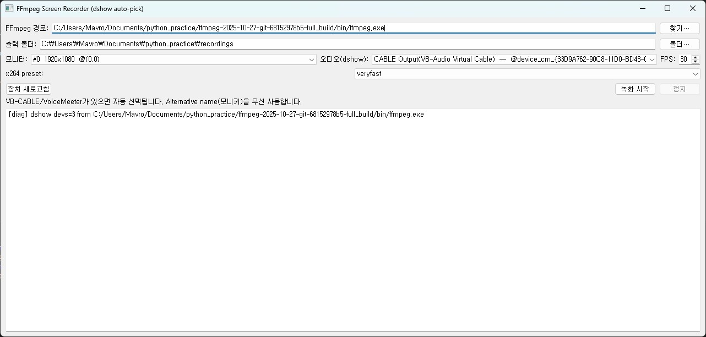

# 🎥 PyQt Screen Recorder (FFmpeg)

**FFmpeg + PyQt5** 기반의 **화면 및 시스템 소리 녹화 도구**입니다.  
간단한 인터페이스로 모니터와 오디오 장치를 선택하여 녹화할 수 있습니다.

---

## 📦 Download  
최신 실행 파일은 아래 링크에서 다운로드할 수 있습니다.  
[⬇️ Download Screen Recorder v1.0.0](https://github.com/mavro7910/pyqt_ffmpeg_screenrec/releases/latest)

---

## ⚙️ Prerequisites

Before running the program, make sure you have installed these two components:


| Item | Description | Download |
|------|--------------|-----------|
| 🎬 **FFmpeg** | Core library for video/audio encoding and recording | [🔗 FFmpeg official builds (Windows)](https://www.gyan.dev/ffmpeg/builds/) |
| 🎧 **VB-Audio Virtual Cable** | Virtual audio device that lets you capture system sound | [🔗 VB-Audio Virtual Cable official site](https://vb-audio.com/Cable/) |

> 💡 After installing FFmpeg, set the path to `ffmpeg.exe` in the program’s settings.  
> 💡 After installing VB-Audio, “CABLE Output (VB-Audio Virtual Cable)” will appear in the audio device list.

---

## 📁 Project Structure

```
pyqt-ffmpeg-screenrec/
├─ assets/
│  ├─ app_icon.ico          # 빌드용 아이콘
│  ├─ screenshots/
├─ core/
│  ├─ __init__.py
│  ├─ ffmpeg_recorder.py    # FFmpeg 녹화 제어 로직
│  ├─ device_utils.py       # 오디오 장치 탐색 (dshow)
│  ├─ monitor_utils.py      # 모니터 정보 수집
│  ├─ settings.py           # 사용자 설정 저장/로드
├─ ui/
│  ├─ __init__.py
│  ├─ main_window.py        # PyQt 메인 윈도우
├─ main.py                  # 프로그램 진입점
├─ requirements.txt
├─ .gitignore
└─ README.md
```

---

## 📌 Features

| 기능 | 설명 |
|------|------|
| 🖥️ **화면 녹화 (Screen Capture)** | 선택한 모니터의 전체 화면을 고화질로 녹화 |
| 🔊 **시스템 오디오 녹음** | VB-Audio Virtual Cable 등 가상 장치를 통한 시스템 소리 캡처 |
| 🎙️ **마이크 녹음 지원** | DirectShow 기반 입력 장치 선택 가능 |
| 🧰 **FFmpeg 통합 제어** | PyQt5 GUI에서 ffmpeg 명령 자동 실행 |
| 💾 **자동 저장** | 녹화된 영상은 지정된 폴더에 자동으로 저장 |
| ⚙️ **사용자 설정 저장** | 마지막 사용한 경로, 프레임, 프리셋, 오디오 장치 등을 기억 |

---

## 🖼️ Screenshots


### 🎬 Main Window


---

## ⚙️ Installation

### 1️⃣ Clone this repository
```bash
git clone https://github.com/mavro7910/pyqt-ffmpeg-screenrec
cd pyqt-ffmpeg-screenrec
```

### 2️⃣ Install dependencies
```bash
pip install -r requirements.txt
```

---

## 🚀 Run
```bash
python main.py
```

---

## ⚙️ Build (Windows .exe)

```bash
# Clean previous builds
Remove-Item -Recurse -Force .venv, build, dist
Remove-Item -Force *.spec
```

```bash
# 1️⃣ Create a new virtual environment
python -m venv .venv
```

```bash
# 2️⃣ Activate
.venv\Scripts\activate
```

```bash
# 3️⃣ Install dependencies
pip install -U pip setuptools wheel
pip install -r requirements.txt
```

```bash
# 4️⃣ Build .exe
pyinstaller --noconsole --onefile --clean `
--name "ScreenRecorder" `
--icon "assets/app_icon.ico" `
--add-data "assets;assets" `
main.py
```

```bash
# 5️⃣ Deactivate
deactivate
# ./dist 폴더 내 ScreenRecorder.exe 실행 가능
```

---

## 🧠 Tech Stack
- **Language:** Python 3.10+
- **Framework:** PyQt5
- **Media Engine:** FFmpeg
- **Audio Input:** DirectShow (VB-Audio, Realtek 등)
- **Features:** QProcess 기반 비동기 FFmpeg 제어, 다중 모니터 지원

---

## ✨ Author  
**Kwangho Lee (이광호)**  
Department of Mechanical Engineering, Sungkyunkwan University  

- GitHub: [@mavro7910](https://github.com/mavro7910)  
- Email: [kwangho97@g.skku.edu]

---

## 📜 License
MIT License  
Copyright © 2025 Kwangho Lee